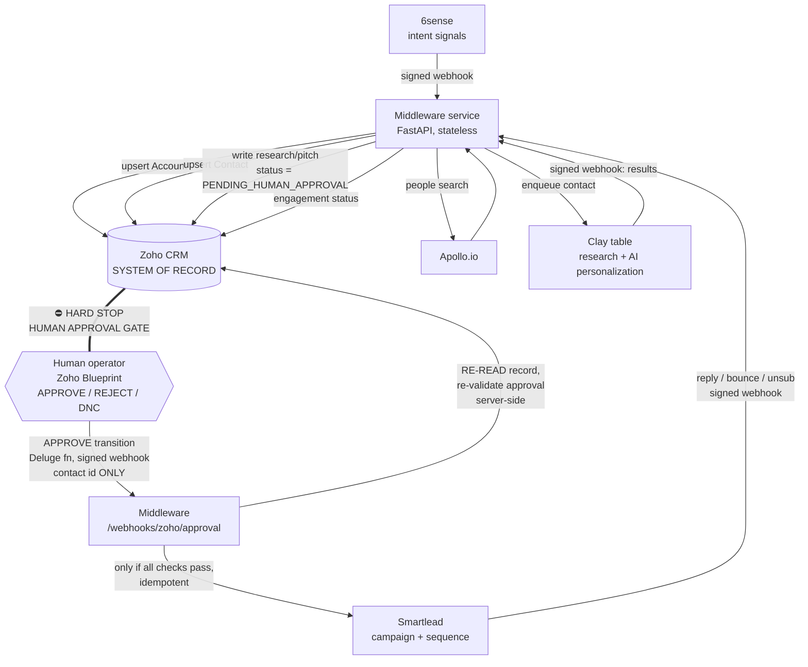

# BookLender B2B Sales Automation — Architecture

## 1. System architecture



Design choice: a small self-hosted **middleware service** (FastAPI) instead
of Make/Zapier for every hop. Rationale (§32 of the requirements): the
approval gate is a *security boundary* and must re-query Zoho and enforce
idempotency server-side — filter steps in Make/Zapier cannot be trusted for
that and cannot do HMAC verification + atomic idempotency claims. Make or
Zapier remain fine as optional transport for low-risk hops (e.g. relaying
6sense → middleware if 6sense's native webhook can't sign requests), but
nothing on the approval path may bypass the middleware.

## 2. Approval state machine

Authoritative implementation: `middleware/booklender/state_machine.py`
(tests enforce it). Stored in Zoho `Contacts.Approval_Status`.

```
NEW → INTENT_DETECTED → CONTACT_IDENTIFIED → RESEARCH_COMPLETE
    → PERSONALIZATION_READY → PENDING_HUMAN_APPROVAL
                                   │  (HUMAN ONLY — Zoho Blueprint)
                     ┌─────────────┼──────────────┐
                 APPROVED       REJECTED     NEEDS_REVIEW ⇄ PENDING…
                     │
             QUEUED_FOR_OUTREACH → SENT_TO_SMARTLEAD → ACTIVE_SEQUENCE
                     → REPLIED / BOUNCED / UNSUBSCRIBED / COMPLETED
Any state → ERROR / NEEDS_REVIEW / DO_NOT_CONTACT (DNC terminal)
```

`PENDING_HUMAN_APPROVAL → APPROVED` is in `HUMAN_ONLY_TRANSITIONS`: the
middleware raises if any automated code path attempts it (tested).

## 3. Approval gate — layered enforcement

| Layer | Mechanism | Defeats |
|---|---|---|
| 1. Zoho Blueprint | Only "BookLender Approver" profile can execute APPROVE; entry criteria (email, personalization, no existing lead, not opted out) | accidental UI approval |
| 2. Zoho permissions | Middleware uses an integration user *without* the Approver profile; approval fields read-only for other humans | middleware or rogue user forging approval in CRM |
| 3. Webhook auth | HMAC-SHA256 over raw body, per-source secrets, constant-time compare | forged webhook calls |
| 4. **Server-side re-validation** | Dispatch ignores the payload (id only), re-reads Zoho, checks status/timestamp/approver/opt-out/personalization | stale, forged or replayed payloads; Make/Zapier misconfiguration |
| 5. Idempotency | claim on `(contact_id, approval_timestamp)` + `Smartlead_Lead_ID` field + live Smartlead lookup | duplicate sends |
| 6. test_mode interlock | config `test_mode: true` (default) blocks all live sends | premature production traffic |

## 4. Data flow / sequence (happy path)

1. 6sense signal → `POST /webhooks/sixsense` (HMAC) → qualification rules
   (config.yaml) → Zoho Account upsert keyed on `Company_Domain` →
   `Prospect_Status=INTENT_DETECTED`.
2. Apollo people search (configurable titles/seniorities, verified emails
   only, max N per account) → dedupe by email + `Apollo_Person_ID` → Zoho
   Contact upsert with field-precedence rules → `CONTACT_IDENTIFIED` →
   enqueue to Clay table webhook → `Clay_Enrichment_Status=QUEUED`.
3. Clay runs research + AI columns (see docs/setup-guide.md §Clay) →
   final HTTP-API column posts results to `POST /webhooks/clay`.
4. Middleware writes work model, confidence, research, pitch, CTA →
   `Approval_Status=PENDING_HUMAN_APPROVAL` (or `NEEDS_REVIEW` if
   personalization incomplete). **The machine stops.**
5. Human reviews in Zoho, clicks APPROVE → Blueprint validates → Deluge
   stamps `Approved_By`/`Approval_Timestamp` → signed webhook with contact
   id → middleware re-validates everything → routes to Smartlead campaign
   by configured work-model rules → exactly one lead created →
   `SENT_TO_SMARTLEAD`, `Outreach_Status=ACTIVE`.
6. Smartlead events (sent/reply/bounce/unsubscribe) → `POST /webhooks/smartlead`
   → Zoho engagement fields; unsubscribe also sets `Email_Opt_Out=true`.

## 5. Field precedence

`Verified CRM > Apollo > Clay enrichment > AI inference.`
Apollo never overwrites populated identity fields (name/email/title/
LinkedIn); AI writes only into `AI_*` fields and never touches contact
identity. Enforced in `apollo_discovery.py` (tested).

## 6. Error handling & retries

- Transient (HTTP 429/5xx, network): exponential backoff 2s→4s→8s…,
  configurable cap (`retry:` in config.yaml). Idempotency keys are released
  on failure so redeliveries can retry safely.
- Permanent (invalid email, opt-out, auth failure, malformed, gate
  refusal): never retried; surfaced as 4xx to the caller and written to
  `Integration_Error` / `Smartlead_Sync_Status=ERROR` on the record.
- Every attempt (SUCCESS/RETRY/FAILURE/SKIPPED) lands in the audit log with
  source, destination, entity, action, error, retry count.

## 7. Audit & observability

`booklender/audit.py` (SQLite locally; point `BOOKLENDER_DB` at a mounted
volume; swap for Postgres by replacing the connection). Operator-facing
mirrors: `Integration_Error`, `Smartlead_Sync_Status`, `Clay_Enrichment_Status`
on the record + Zoho dashboards (zoho/blueprint.md §Dashboards) covering
funnel counts, awaiting-approval queue, outcomes, and error queues.

## 8. Security architecture

- Secrets: environment variables only (12-factor); never in YAML, code,
  logs, CRM fields, or AI prompts. Rotate by redeploying env.
- Zoho: OAuth2 refresh-token grant, dedicated integration user, least
  privilege scopes (`ZohoCRM.modules.accounts/contacts.ALL`,
  `ZohoCRM.settings.fields.READ` — plus `.CREATE` only while provisioning).
- Webhooks: per-source HMAC secrets; unauthenticated requests are 401
  before any parsing.
- AI: chain-of-thought/reasoning is never synced to CRM or Smartlead —
  only `research_summary`, `personalized_pitch`, `cta`, `work_model`,
  `confidence`.
